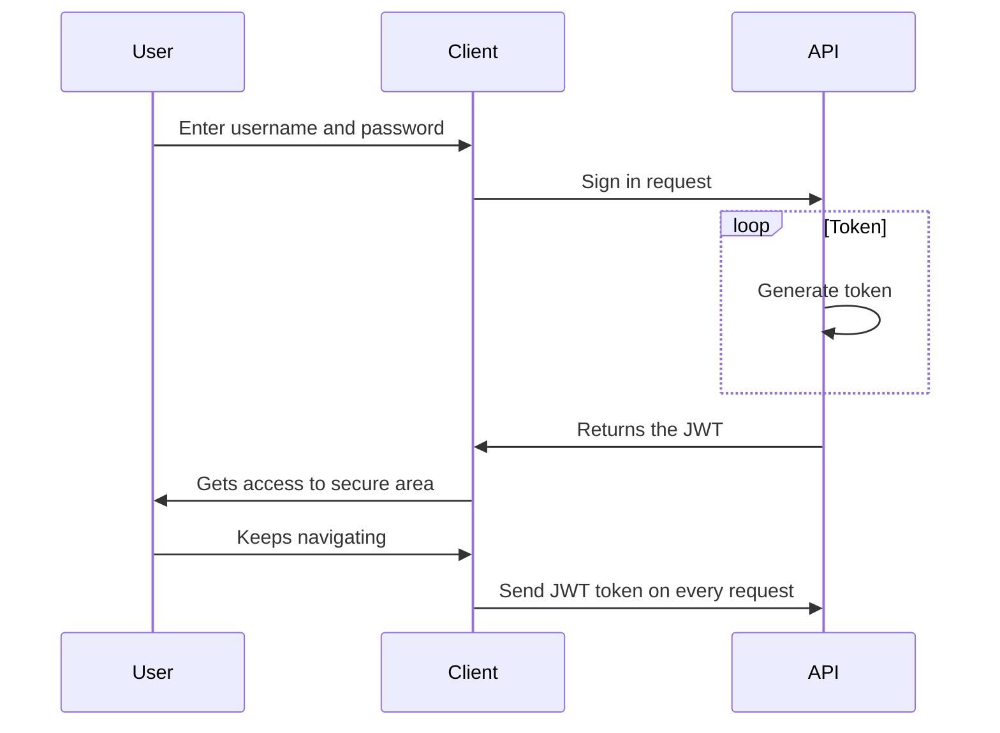

# Tjansformedlingssida-BE
Backend

<h2>Sequence Diagram</h2>

```mermaid
sequenceDiagram
participant User
participant Client
participant API
User->>Client: Enter username and password
Client->>API: Sign in request
loop Token
API->>API: Generate token
end
API->>Client: Returns the JWT
Client->>User: Gets access to secure area
User->>Client: Keeps navigating
Client->>API: Send JWT token on every request
```
