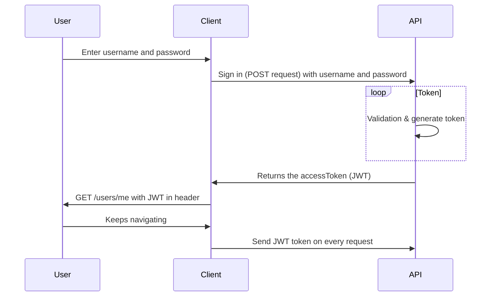

# Tjänstförmedling backend


## Scheduele 

| # Our   |      # Weekly      |  # Plans |
|----------|-------------|------|
| Dag |  Tid | Plats |
| Måndag |    10.00   |   Stan |
| Tisdag |    09.00   |   Skolan |
| Onsdag |    10.00   |   Online/discord |
| Torsdag |   09.00   |   Skolan |
| Fredag |    13.00   |   Online |


## Technologies

**Backend technologies:**
+ Nodejs
+ MongoDB

**Test technologies:**
+ Jestjs


## TTFHW

To access the repository, make sure you are a collaborator, so that you can clone the repo in your workspace folder with this command:

```javascript
git clone "https://github.com/Tootfarangi90/Tjanstformedlingssida-BE.git"
```

How to receive the latest data:

```javascript
git pull
```

How to install all the modules:

```javascript
npm i
```

How to open up the project at Visual studio code: 

```javascript
code .
```


## Onboarding

Nodemon is saved under dependecies, so you start the project like this:

```javascript
npm run dev
```


## Script for development environment

We use docker for our development environment and down under you can see how to set up docker.


+ For the database:

```javascript
docker run -d --name test-mongodb \
    -p 27017:27017 \
    -e MONGO_INITDB_ROOT_USERNAME=root \
    -e MONGO_INITDB_ROOT_PASSWORD=root \
    mongo
    
    docker logs test-mongodb --follow
```

+ For the backend:

```javascript
FROM node:12-alpine

RUN mkdir -p /home/node/app/node_modules && chown -R node:node /home/node/app

WORKDIR /home/node/app

COPY package*.json ./

USER node

RUN npm install

COPY --chown=node:node . .

EXPOSE 3000

CMD [ "node", "app.js" ]
```

## Script for testing

We used jest js for testing our application

You need to run these two commands to start your environment

```javascript
npm i jest --save-dev

npm i jest-runner-groups

mkdir __tests__

touch ./__tests/unitTest.js

touch ./__tests/componentTest.js

touch ./__tests/integrationTest.js

```
Give each file one or more group names to that you can easily choose which one to run.

```javascript
/**
 * Unit test

@group unit

*/

...

```
```javascript
/**
 * Unit test

@group component

*/

...

```
```javascript
/**
 * Unit test

@group integration

*/

...

```

Add this to package.json

```javascript
  "scripts": {
    ...

    "test": "jest --group=unit",
    "component": "jest --group=component",
    "integration": "jest --group=integration"
  },

...

```
And this

```javascript
  "jest": {
    "runner": "groups"
  },

```

## Sequence diagram for JWT:




