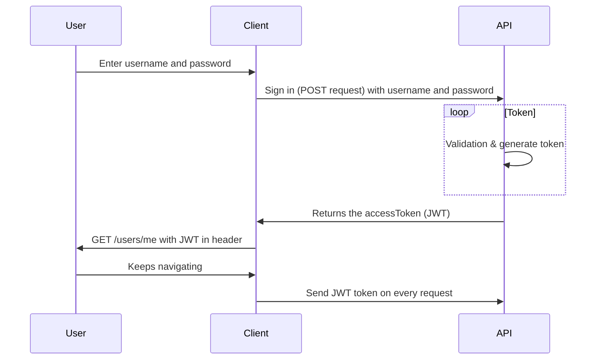

# Tjänstförmedling backend

| # Our   |      # Weekly      |  # Plans |
|----------|-------------|------|
| Dag |  Tid | Plats |
| Måndag |    10.00   |   Stan |
| Tisdag |    09.00   |   Skolan |
| Onsdag |    10.00   |   Online/discord |
| Torsdag |   09.00   |   Skolan |
| Fredag |    13.00   |   Online |

## Table of content
1. [Technologies](#technologies)
    1. [Backend technologies](#backend-technologies)
    2. [Test technologies](#test-technologies)
2. [TTFHW](#ttfhw)
3. [Omboarding](#onboarding)
4. [Sequence diagram](#sequence-diagram)

## Technologies

### **Backend technologies**
+ Nodejs
+ MongoDB

## **Test technologies**
+ Jest

## TTFHW

To access the repository, make sure you are a collaborator, so that you can clone the repo in your workspace folder with this command:

```javascript
git clone "https://github.com/Tootfarangi90/Tjanstformedlingssida-BE.git"
```

How to receive the latest data:

```javascript
git pull
```

How to install all the modules:

```javascript
npm i
```

How to open up the project at Visual studio code: 

```javascript
code .
```


## Onboarding

Nodemon is saved under dependecies, so you start the project like this:

```javascript
npm run dev
```

We have a database where users store their profiles. We use mongoose.


### Sequence Diagram


