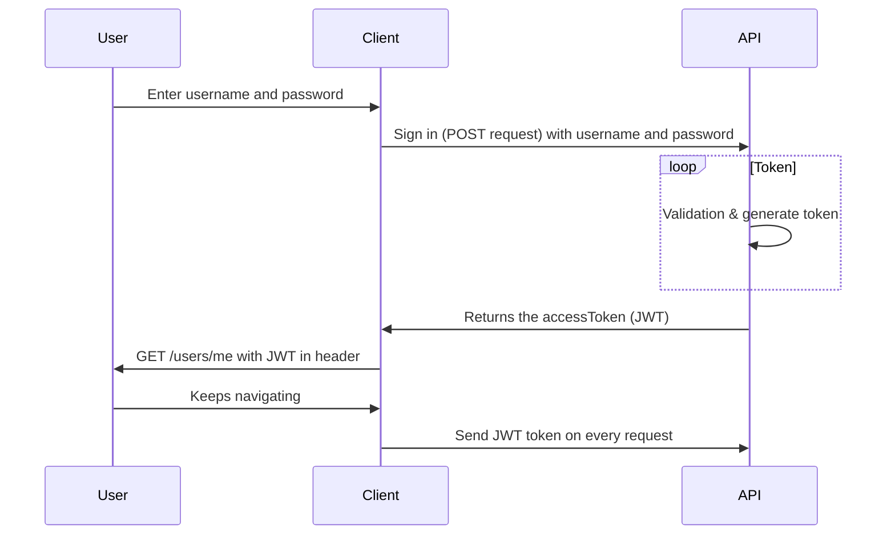

# Tjänstförmedling backend

## Table of content

### Technologies

Nodejs
MongoDB
Trello

### TTFHW

```javascript
cd ~
cd workspace
cd tjänstförmedling
git clone "https://github.com/Tootfarangi90/Tjanstformedlingssida-BE.git"
git pull
npm i
touch .env
code .
```

### Onboarding

### Sequence Diagram


