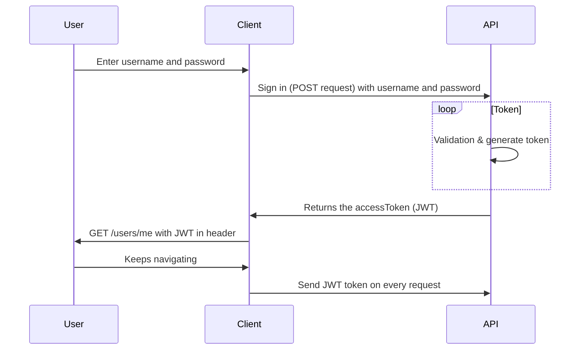

# Tjänstförmedling backend

## Scheduele 

| # Our   |      # Weekly      |  # Plans |
|----------|-------------|------|
| Dag |  Tid | Plats |
| Måndag |    10.00   |   Stan |
| Tisdag |    09.00   |   Skolan |
| Onsdag |    10.00   |   Online/discord |
| Torsdag |   09.00   |   Skolan |
| Fredag |    13.00   |   Online |


## Technologies

### **Backend technologies**
+ Nodejs
+ MongoDB

### **Test technologies**
+ Jest

## TTFHW

+ To access the repository, make sure you are a collaborator, so that you can clone the repo in your workspace folder with this command:

```javascript
git clone "https://github.com/Tootfarangi90/Tjanstformedlingssida-BE.git"
```

+ How to receive the latest data:

```javascript
git pull
```

+ How to install all the modules:

```javascript
npm i
```

+ How to open up the project at Visual studio code: 

```javascript
code .
```

## Onboarding

+ Nodemon is saved under dependecies, so you start the project like this:

```javascript
npm run dev
```

**Script of how to create a development environment**

+ The database environment:

```javascript
docker run -d --name test-mongodb \
    -p 27017:27017 \
    -e MONGO_INITDB_ROOT_USERNAME=root \
    -e MONGO_INITDB_ROOT_PASSWORD=root \
    mongo
    
    docker logs test-mongodb --follow
```

+ The backend environment:

```javascript
FROM node:12-alpine

RUN mkdir -p /home/node/app/node_modules && chown -R node:node /home/node/app

WORKDIR /home/node/app

COPY package*.json ./

USER node

RUN npm install

COPY --chown=node:node . .

EXPOSE 3000

CMD [ "node", "app.js" ]
```

### Sequence diagram for JWT



